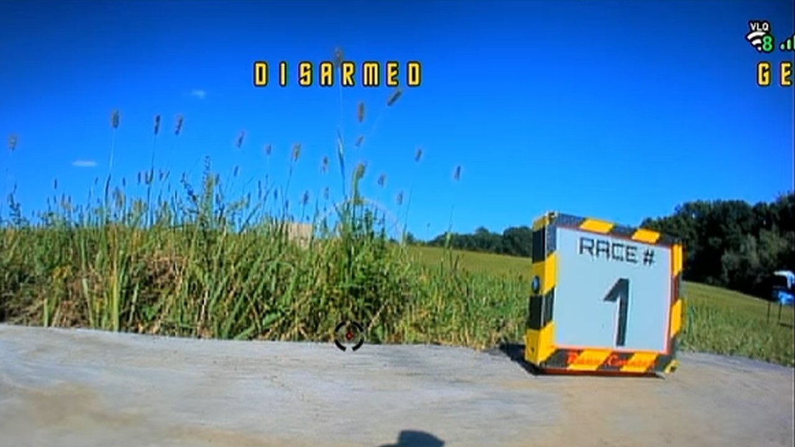
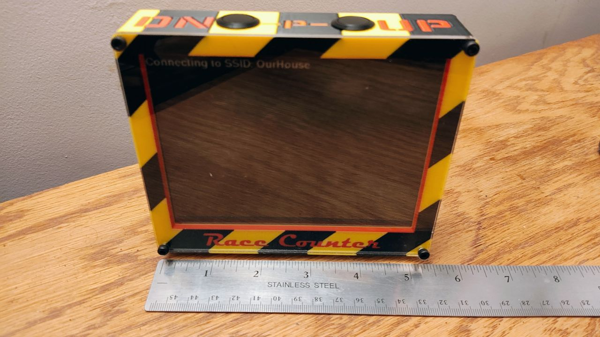
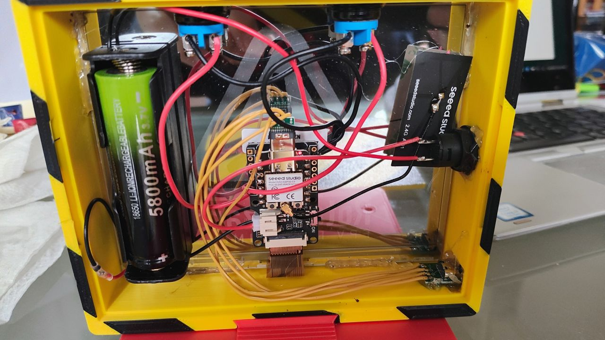
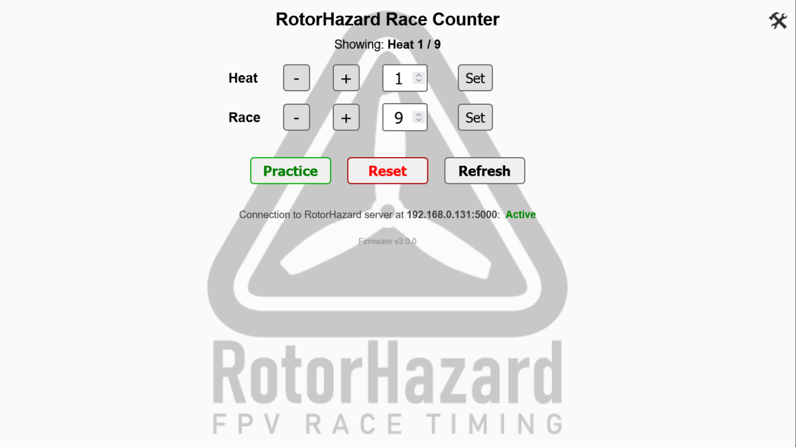
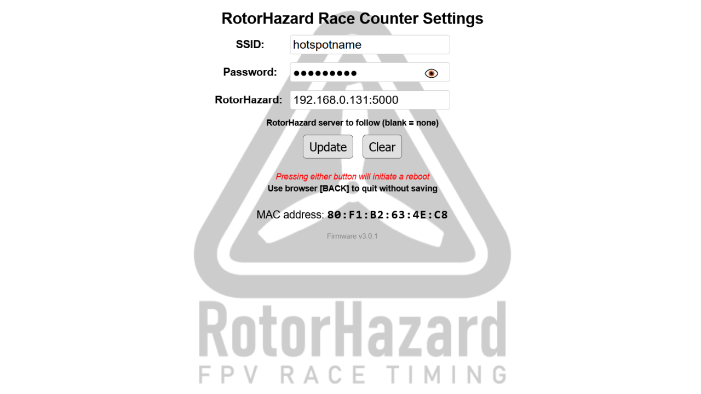

# RotorHazard Race Counter

A battery-friendly ePaper sign that shows the current **heat** and **race number** at the flight line, so
pilots and spectators can always tell which race is up. Designed and built by RocketSled.

The display is a Seeed XIAO ESP32-C3 driving a 5.83" 648×480 monochrome ePaper panel in a 3D-printed
housing with two push-buttons (DN / UP). It can be run standalone from the buttons, or over WiFi from a
small built-in web page and HTTP API – or, given the address of a [RotorHazard](https://github.com/RotorHazard/RotorHazard)
timer, it follows the timer's current heat and round by itself.



## Repository layout

| Path | Contents |
|---|---|
| `firmware/RaceCounter/` | Arduino sketch (RocketSled's V2.0 of Aug 9 2026, plus the fixes listed in `git log`), as modules: `RaceCounter.ino` (`setup`/`loop`), `RaceCounter.h` (config + shared state), `display.h/.cpp` (ePaper drawing), `web.h/.cpp` (web UI / HTTP API), `wifi_config.h/.cpp` (WiFi, setup AP, credentials, standalone mode), `buttons.h/.cpp`, `rh_client.h/.cpp` (follows a RotorHazard timer) |
| `firmware/RaceCounter/sketch.yaml` | Board / partition / option settings, read by arduino-cli and Arduino IDE 2.2+ |
| `firmware/RaceCounter/bg_png.h` | Web-page background image (RotorHazard logo) embedded as a byte array; regenerate with `tools/bin2header.py` |
| `firmware/RaceCounter/driver.h` | Seeed_GFX hardware selection (board + panel). **Required** – see Building |
| `firmware/libraries/` | Git submodules, pinned: `Seeed_GFX` (display), `WebSockets` (Socket.IO client), `ArduinoJson` |
| `docs/parts-list.md` | Bill of materials |
| `pics/` | Photos of the built unit and screenshots of the web pages |
| `assets/` | Source font (Orbitron Bold, OFL) and logo images used to generate the `.h` bitmaps |
| `tools/bin2header.py` | Turns a binary file into a `PROGMEM` C array header |

## Hardware

* Seeed Studio **XIAO ESP32-C3**
* Seeed **ePaper Driver Board for XIAO** (V2) – 24-pin FPC, JST battery input with charge IC
* **5.83" monochrome ePaper**, 648×480, UC8179 controller, 24-pin FPC
* Two momentary push-buttons to GND: **DN → D5**, **UP → D6** (internal pull-ups)
* 18650 Li-ion cell with a latching power button; USB-C pass-through port for charging and programming
* 3D-printed housing (STLs not yet in this repo)

Full list with links: [docs/parts-list.md](docs/parts-list.md).

| Front | Inside |
|---|---|
|  |  |

## Building the firmware

RocketSled builds with Visual Studio + VisualMicro; the sketch also builds in the Arduino IDE 2.x and with
`arduino-cli`. Verified 2026-09-20 with `arduino-cli` 0.35.2, esp32 core 3.3.8, Seeed_GFX 2.0.3
(commit `0dfdd71`), WebSockets 2.7.3 and ArduinoJson 7.4.2:

```
Sketch uses 1510517 bytes (48%) of program storage space. Maximum is 3145728 bytes.
Global variables use 39152 bytes (11%) of dynamic memory.
```

The board and options are recorded in `firmware/RaceCounter/sketch.yaml`, which arduino-cli and Arduino
IDE 2.2+ pick up automatically, so the command line is just:

```bash
arduino-cli compile --libraries firmware/libraries firmware/RaceCounter
```

1. **Board package:** *esp32 by Espressif Systems* (RocketSled used 3.3.8; board-manager URL
   `https://espressif.github.io/arduino-esp32/package_esp32_index.json`). Board: **XIAO_ESP32C3**.
   * Partition Scheme: **Huge APP (3MB No OTA/1MB SPIFFS)** – the sketch filled 95 % of the default
     scheme's 1.2 MB app slot, and the device doesn't use OTA, so the larger no-OTA layout costs nothing.
     (RocketSled's units were flashed with the *Default 4MB* scheme; re-flashing with this one is fine – the
     partition table is rewritten as part of the upload.)
   * USB CDC On Boot: **Enabled**
2. **Libraries:** **[Seeed_GFX](https://github.com/Seeed-Studio/Seeed_GFX)** (display; not in the Arduino
   Library Manager), **[WebSockets](https://github.com/Links2004/arduinoWebSockets)** (Socket.IO client) and
   **[ArduinoJson](https://arduinojson.org/)** are vendored as git submodules under `firmware/libraries/`,
   pinned to versions known to build. Get them with
   ```bash
   git submodule update --init
   ```
   (or clone with `--recurse-submodules`). Then make them visible to the Arduino IDE by linking or copying
   each into your sketchbook's `libraries` folder – on Windows a directory junction avoids a second copy:
   ```
   mklink /J "<sketchbook>\libraries\Seeed_GFX" "<repo>\firmware\libraries\Seeed_GFX"
   ```
   (and likewise for `WebSockets` and `ArduinoJson`). `arduino-cli` users can skip the links and pass
   `--libraries firmware/libraries` instead.

   Seeed_GFX is a fork of TFT_eSPI and **conflicts with TFT_eSPI / Adafruit_GFX – remove those from your
   `libraries` folder first.** The sketch will still compile against the wrong library, it just won't drive
   the panel.
3. **`driver.h`** must be in the sketch folder (it is). Seeed_GFX picks it up automatically:
   ```c
   #define BOARD_SCREEN_COMBO 503   // 5.83 inch monochrome ePaper (UC8179), 648x480
   #define USE_XIAO_EPAPER_DRIVER_BOARD
   ```
   If you change the panel or carrier board, regenerate this with Seeed's configuration tool.
4. Compile and upload the sketch over USB-C. That's it – there is no separate filesystem image to upload;
   the web page's background image is compiled into the firmware (`bg_png.h`).

All other libraries (`WiFi`, `WebServer`, `HTTPClient`, `Preferences`) ship with the esp32 core.

## Operation

### First power-up / WiFi setup

* With no saved credentials the device starts an open access point **`RaceCounter-Setup`** and shows the AP
  IP (`192.168.4.1`) and MAC on the panel. Connect to it, open `http://192.168.4.1`, enter your SSID and
  password, *Save & Reboot*.
* It then connects to that network, shows the IP it was given and its MAC for a few seconds, and displays
  the RotorHazard splash screen. The web interface is at `http://<ip>/`.
* Every startup / status text screen has the name and firmware version on its first line.
* The MAC shown on both the AP screen and the "Connected" screen is the station MAC – the one your router
  sees – so it can be used directly for a static DHCP lease.

### Buttons

| Action | Result | Timing |
|---|---|---|
| UP | race number +1 (1…99, wraps) | Acts the moment the button is released, or after 0.25 s if it is held. Keep holding and it keeps stepping, one step per panel refresh (every 2–4 s). |
| DN | race number −1 (1…99, wraps) | Same as UP. Does nothing while the splash screen is showing. |
| UP or DN on a PRACTICE screen | leave practice: the big-"P" screen goes back to the race count, the "PRACTICE over a round number" screen switches its banner to "RACE #" – the number is not changed either way | |
| UP + DN together (short), in normal operation | toggle **PRACTICE** mode | The second button must go down within 0.25 s of the first; acts when either is released (before 3 s). |
| UP + DN **held for 3 s** | show the **information screen**: mode, SSID, IP, web address, signal, MAC, what was being shown, uptime, free memory | Acts at 3 s while both are still down. Any button press on the information screen goes back to the previous screen (splash / race count / practice) without changing anything. |
| UP + DN held at power-on | erase saved WiFi credentials and standalone flag, restart into AP mode | The pins are read **once**, about 2–3 s after power-on. Hold both before switching on, keep holding until "Old SSID and password deleted…" appears, then release. |
| UP + DN while "Connecting to SSID…" | same – use this if it is stuck on a network it can't reach | Checked every 0.3 s while connecting; any simultaneous press of ≥ 0.3 s works. |
| UP + DN while in AP mode | short: enable **standalone mode** (no WiFi, buttons only) and restart; long: information screen | Same detection as above. To leave standalone mode, use the power-on hold. |

Heat number can only be set from the web interface / HTTP API.

### Web interface

The main page shows what the panel is currently displaying, and has −/+ and *Set* controls for Heat and Race,
a *Practice* toggle, *Reset*, and *Refresh* (re-reads the current state from the counter), with the firmware
version at the bottom. The 🛠 icon
top-right opens the settings page where the SSID/password can be changed (*Update*) or erased (*Clear*);
both reboot the device. The settings page also has the **RotorHazard** server field (below) and shows the MAC
address and firmware version (`FW_VERSION` in `RaceCounter.h`, also printed in the serial banner at boot).

| Main page | Settings page |
|---|---|
|  |  |

### Following a RotorHazard timer

Enter the timer's address in the **RotorHazard** field on the settings page – `host` or `host:port`
(`192.168.1.10`, `rotorhazard.local:5000`; the port defaults to 5000) – and *Update*. Leave it blank to
turn this off. Nothing needs to be installed or configured on the timer; RotorHazard 4.1 or later.

The counter then connects to the server as a Socket.IO client, the same way a browser page does, and:

* asks for the current state (`load_data`), then listens to the `race_status` / `current_heat` broadcasts
  the server sends whenever a race is staged, started, stopped or saved, or the heat is changed;
* takes the heat id and `next_round` from them – the round that is being run or about to be run. Heat and
  race-format names come over the socket too (`heat_list` / `format_data` on connect, `heat_data` when a heat
  is renamed), with `GET /api/heat/<id>` / `/api/format/<id>` as the fallback for anything not in those lists;
  if the lists are too large for the counter's WebSocket library (over 15 KB – a very big event) it switches
  to the `/api` lookups for the rest of the session (`/status` → `rh.names_from`);
* shows the heat name as the banner and `next_round` as the big number – or `next_round + 1` once a race has
  been stopped but not yet saved, so the next race is announced right away. Heat 0 on the timer (no heat
  selected, "Practice Mode") shows the PRACTICE screen with the big "P"; a real heat run with a practice race
  format (any format whose name contains "practice", such as the stock "Open Practice") shows "PRACTICE" as
  the banner with the round number below it. Whenever the banner is anything other than "RACE #", a
  vertical "ROUND" label is drawn to the left of the number (for numbers below 20 – wider ones fill the
  panel). The panel only refreshes when something actually changed.

The buttons and web page keep working as manual overrides; the next event from the timer wins.

The link is supervised: the timer broadcasts a heartbeat every 0.5 s, and if nothing at all arrives for 10 s
the connection is treated as **lost** – a warning triangle appears in the top-right corner of the panel,
the main web page shows *Connection to RotorHazard server at host:port: Lost* in red (*Active* otherwise),
and the counter forces a reconnect. It clears itself as soon as traffic resumes. The state is also on the
information screen (hold both buttons) and in `/status` (`rh.state`: `active` / `lost`).
The results broadcast the timer sends after each saved race is bigger than the WebSocket library accepts,
so the connection drops and reconnects a few seconds later at that point; the state is re-requested on
every connect, so nothing is missed.

### HTTP API

Every endpoint except `/reset` is a plain `GET`, changes the display, and replies `303 → /` (so a browser
lands back on the main page). Scripts should send `allow_redirects=False` or just ignore the redirect.

| Endpoint | Effect |
|---|---|
| `/heatInc`, `/heatDec` | heat ±1 (0…99, wraps); race resets to 1 |
| `/heatSet?v1=N` | set heat to N (0–99). Heat 0 hides the heat number; banner shows "RACE #". Nonzero heat shows "Heat N" and resets race to 1 |
| `/raceInc`, `/raceDec` | race ±1 (1…99, wraps) |
| `/raceSet?v2=N` | set race to N (1–99) |
| `/practice` | **toggle** practice mode (banner "PRACTICE", big "P") |
| `/splash` | heat 0, race 0, practice off, show the RotorHazard splash screen (this is the web *Reset* button) |
| `/settings` | WiFi settings page |
| `/reset` (`POST` only) | **erases the saved WiFi credentials** and reboots into AP mode (the settings-page *Clear* button, behind a confirmation) |
| `/bg.png` | the web page background image |
| `/status` | **read-only** JSON: `name`, `version`, `mode` (`wifi` / `ap` / `standalone`), `ssid`, `ip`, `rssi`, `mac`, `heat`, `race`, `practice`, `banner`, `screen` (`splash` / `counter` / `practice` / `info` / `ap_setup` / `status`), `rh` (`server`, `state`, `heat_id`, `round`, `heat_name`, `names_from`), `uptime_s`, `free_heap`. Also available in AP mode. |

Out-of-range values are ignored.

## Known issues / roadmap

The sketch is RocketSled's V2.0 plus a series of small fixes, each its own commit – see `git log`. The
first import commit holds the code exactly as received. Note for anyone building from that original: the
Arduino build system matches include names to libraries case-sensitively even on Windows, so
`<webserver.h>` / `<preferences.h>` had to become `WebServer.h` / `Preferences.h` (VisualMicro is more
forgiving).

Remaining items:

* The WiFi connect loop never times out (the only escape is holding both buttons).

## Credits

Hardware, housing and firmware by RocketSled. Orbitron font by Matt McInerney, SIL Open Font License.

## License

[MIT](LICENSE). The RotorHazard name and logo are copyright Michael Niggel/Hazard Creative, LLC and are used
under the RotorHazard project's own terms (see the note in `LICENSE`); they are not covered by the MIT license.
